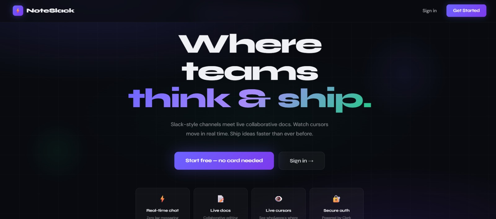
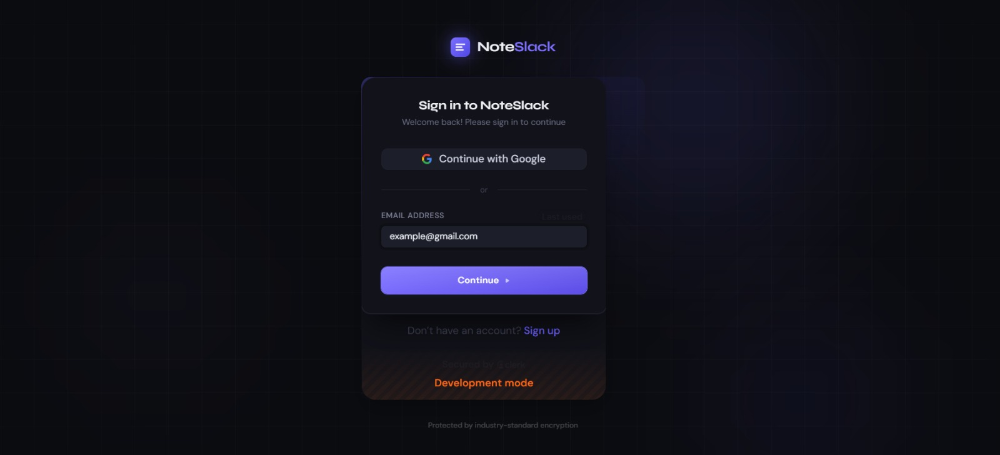
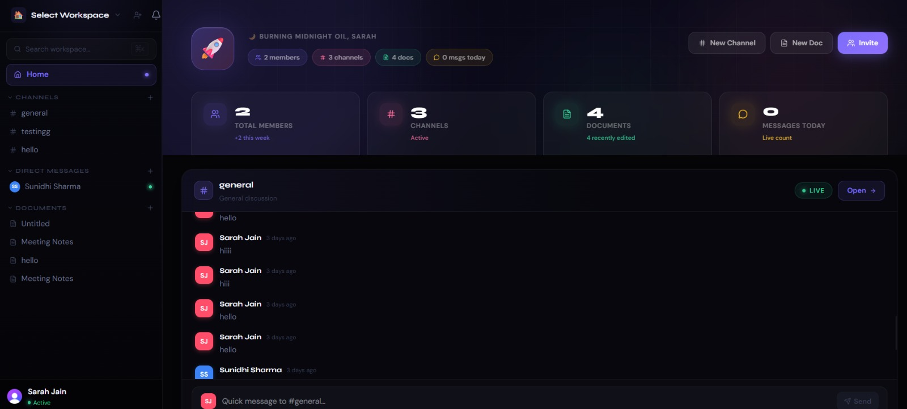
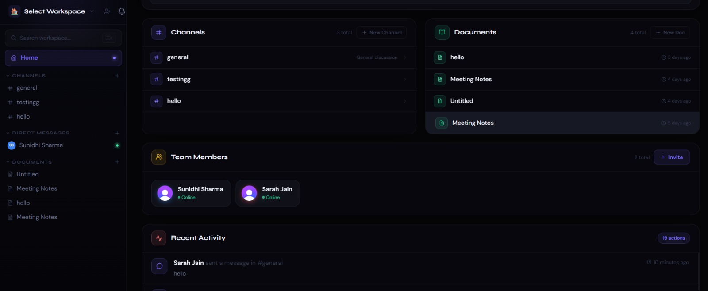
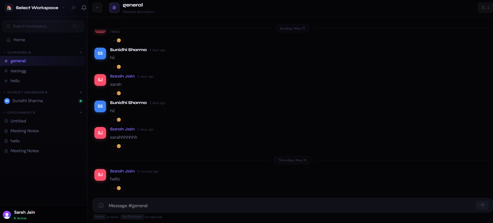
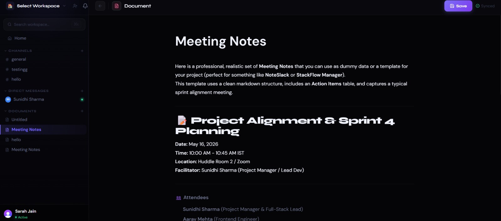

<div align="center">


<h1>⚡ NoteSlack</h1>

<p><strong>Real-time team collaboration — Slack-style channels meets live collaborative docs.</strong><br/>
Watch cursors move. Ship ideas faster. All in one workspace.</p>

[](https://note-slack.vercel.app/)

[](https://nextjs.org/)
[](https://supabase.com/)
[](https://clerk.com/)
[](https://www.typescriptlang.org/)
[](https://tiptap.dev/)
[](https://note-slack.vercel.app/)

</div>

---

## 🌐 Live Demo

> **Try it now → [https://note-slack.vercel.app/](https://note-slack.vercel.app/)**

Sign in with Google or create an account, spin up a workspace, invite a teammate, and start chatting + collaborating on docs — all in real time.

---

## 📸 Screenshots

| Landing Page | Sign In |
|---|---|
|  |  |

| Workspace Home | Home Overview |
|---|---|
|  |  |

| Channel Chat | Document Editor |
|---|---|
|  |  |

---

## ✨ Features

### 💬 Real-Time Chat
- Zero-lag messaging via **Supabase Realtime**
- Threaded replies, emoji reactions, edit & delete
- Typing indicators — *"Alice is typing…"*
- Unread badges per channel
- Live chat preview directly on the workspace home

### 📄 Live Collaborative Documents
- Rich-text editor powered by **Tiptap v3** (Bold, Italic, Lists, Code, Headings, Quotes)
- **Live collaborative editing** via Y.js + Supabase CRDT sync
- **Live cursors** showing exactly where teammates are in real time
- Auto-save with debounced title updates + collaborator avatars in toolbar

### 🏠 Workspaces
- Multiple workspaces with custom name & emoji icon
- Quick workspace switcher dropdown
- Invite teammates by email
- Role-based access: `owner` · `admin` · `member`
- Activity feed, member overview, and channel list on the home dashboard

### 🔍 Global Search
- **⌘K** search palette — instant results across messages, docs & channels
- Full keyboard navigation

### 🔔 Notifications
- Live bell icon with unread badge
- Mark individual or all notifications as read
- Click-to-navigate to the relevant resource

### 💌 Direct Messages
- 1-on-1 DMs with any workspace member
- Real-time delivery, persisted per workspace

### 🔐 Secure Auth
- **Clerk** authentication — Google OAuth, email sign-in, sign-up
- JWT-secured Supabase queries with Row Level Security enforced

---

## 🛠 Tech Stack

| Layer | Technology |
|---|---|
| Framework | Next.js 16 (App Router) |
| Auth | Clerk (Google OAuth + Email) |
| Database | Supabase (PostgreSQL) |
| Realtime | Supabase Realtime |
| CRDT Sync | Y.js + y-supabase |
| Editor | Tiptap v3 |
| State | Zustand |
| Styling | Tailwind CSS v4 + CSS Variables |
| Fonts | Syne (display) + DM Sans (body) |
| Deployment | Vercel |

---

## 🚀 Getting Started

### 1. Clone & Install

```bash
git clone https://github.com/Sunidhi-source/noteSlack
cd noteSlack
npm install
```

### 2. Set Up Clerk

1. Create an app at [dashboard.clerk.com](https://dashboard.clerk.com)
2. Copy your **Publishable Key** and **Secret Key**
3. In **Clerk → Webhooks**, create a webhook pointing to `https://your-domain.com/api/webhooks/clerk`
   - Enable events: `user.created`, `user.updated`, `user.deleted`
   - Copy the **Signing Secret**

### 3. Set Up Supabase

1. Create a project at [supabase.com](https://supabase.com)
2. In **SQL Editor**, paste and run the full contents of `supabase/schema.sql`
3. Copy your **Project URL**, **anon key**, and **service_role key**
4. In **Supabase → Auth → JWT Settings**, add a Clerk JWT template:
   - Template name: `supabase`
   - Claims: `{ "sub": "{{user.id}}" }`
   - Follow [Clerk's Supabase integration guide](https://clerk.com/docs/integrations/databases/supabase)

### 4. Configure Environment

```bash
cp .env.example .env.local
# Fill in all values from steps 2 & 3
```

| Variable | Description |
|---|---|
| `NEXT_PUBLIC_SUPABASE_URL` | Supabase project URL |
| `NEXT_PUBLIC_SUPABASE_ANON_KEY` | Supabase anon key |
| `SUPABASE_SERVICE_ROLE_KEY` | Supabase service role (server only) |
| `NEXT_PUBLIC_CLERK_PUBLISHABLE_KEY` | Clerk publishable key |
| `CLERK_SECRET_KEY` | Clerk secret key |
| `CLERK_WEBHOOK_SECRET` | Clerk webhook signing secret |
| `GEMINI_API_KEY` | AI writing assistant (free at [aistudio.google.com](https://aistudio.google.com)) |

### 5. Run Locally

```bash
npm run dev
# → http://localhost:3000
```

---

## 📁 Project Structure

```
src/
├── app/
│   ├── (auth)/                    # Sign in / sign up (Clerk)
│   ├── (dashboard)/workspace/[id]/
│   │   ├── page.tsx               # Workspace home — activity feed
│   │   ├── channel/[id]/          # Chat view
│   │   ├── docs/[id]/             # Document editor
│   │   └── dm/[userId]/           # Direct messages
│   └── api/
│       ├── workspaces/            # Workspace CRUD
│       ├── workspace/invite/      # Invite teammates
│       ├── channels/              # Channel management
│       ├── documents/             # Document CRUD
│       ├── search/                # Global search
│       ├── notifications/         # Notification read/unread
│       ├── dm/                    # DM conversations
│       └── webhooks/clerk/        # Clerk → Supabase user sync
│
├── components/
│   ├── chat/ChatView.tsx          # Full-featured channel chat
│   ├── editor/DocumentView.tsx    # Collaborative Tiptap editor
│   ├── sidebar/                   # Nav, workspace switcher, modals
│   ├── ui/                        # SearchModal, NotificationBell
│   └── workspace/WorkspaceHome.tsx
│
├── hooks/
│   ├── useWorkspace.ts            # Data + live subscriptions
│   ├── useRealtime.ts             # Messages, typing, threads
│   ├── usePresence.ts             # Live cursors
│   ├── useReactions.ts            # Emoji reactions
│   ├── useSearch.ts               # Debounced global search
│   └── useDmMessages.ts           # DM realtime
│
├── store/workspace.ts             # Zustand global state
├── types/index.ts                 # Full TypeScript types
└── lib/
    ├── utils.ts                   # Helpers
    └── supabase/
        ├── client.ts              # Clerk-authenticated client
        └── server.ts              # Service-role server client

supabase/
└── schema.sql                     # Full DB schema: tables, RLS, triggers, indexes
```

---

## 🚢 Deployment

### Vercel (Recommended)

```bash
npm run build   # verify no TypeScript errors
vercel deploy
```

Add all env vars to your Vercel project settings, then update your Clerk webhook URL to your production domain.

> **Tip:** Ensure tables `messages`, `reactions`, `notifications`, `dm_messages`, and `channel_read_state` are added to the `supabase_realtime` publication. The `schema.sql` handles this automatically.

---

## ✅ Pre-Deploy Checklist

- [ ] Run `supabase/schema.sql` in SQL Editor
- [ ] Row Level Security enabled on all tables *(done in schema)*
- [ ] JWT template for Clerk added in Supabase Auth settings
- [ ] Realtime enabled for `messages`, `reactions`, `notifications`, `dm_messages`
- [ ] `SUPABASE_SERVICE_ROLE_KEY` set in server env *(never exposed to client)*

---

## 🐛 Notable Bug Fixes

| Bug | Fix |
|---|---|
| Workspace creation silently failed | Fixed fetch URL: `/api/workspace` → `/api/workspaces` |
| No error feedback on creation | Added error state + UI error message display |
| Slug collision crashes insert | Added uniqueness check with timestamp fallback |
| Webhook missing `user.deleted` | Added delete handler for Supabase user cleanup |
| `useWorkspaceStore` missing slices | Expanded with `members` and `notifications` state |
| Members not fetched in `useWorkspace` | Added members + notifications fetch with live subs |

---

<div align="center">

Built with ❤️ by [Sunidhi Sharma](https://github.com/Sunidhi-source)

**[🚀 Live Demo](https://note-slack.vercel.app/) · [GitHub](https://github.com/Sunidhi-source/noteSlack)**

<sub>Next.js · Supabase · Clerk · Tiptap · Y.js · Zustand · TypeScript</sub>

</div>
